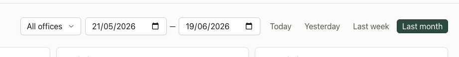
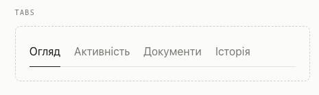

# Design Improvement: Dashboard Date Range

## TL;DR

Use a segmented control for the quick date presets. The options belong to one filter dimension, so tabs would suggest navigation and a primary button incorrectly suggests a main action.

## Current State



The active preset uses the same strong green treatment as a primary CTA, which gives “Last month” too much visual priority.

## Recommended Improvement

### Neutral segmented control

Place all presets inside one subtle surface. Keep inactive options as muted text and show the selected option on a raised white surface with a thin edge and small shadow.

```text
┌──────────────────────────────────────────┐
│ Today │ Yesterday │ Last week │ Last month │
└──────────────────────────────────────────┘
                         └─ selected surface
```

Why this works:

- Presets read as mutually exclusive values of one filter.
- The selected state remains obvious without competing with primary actions.
- The group stays compact and visually connected to the two date fields.
- Native buttons with `aria-pressed` preserve correct interaction semantics.

## Alternative Considered: Underline Tabs



The underline treatment is visually light, but tabs conventionally switch content sections. Using it for a date filter would make the interaction less semantically clear.

## Supporting References

- [MUI date picker shortcuts](https://mui.com/x/react-date-pickers/shortcuts/) treats relative ranges as shortcuts belonging to the picker rather than primary actions.
- [Carbon date picker guidance](https://carbondesignsystem.com/components/date-picker/usage/) keeps date inputs as compact toolbar controls and distinguishes relative dates from exact date entry.

## What Is Already Working

- Exact start and end dates remain directly editable.
- Presets are placed adjacent to the range they affect.
- The filter row is compact enough for dashboard use.
