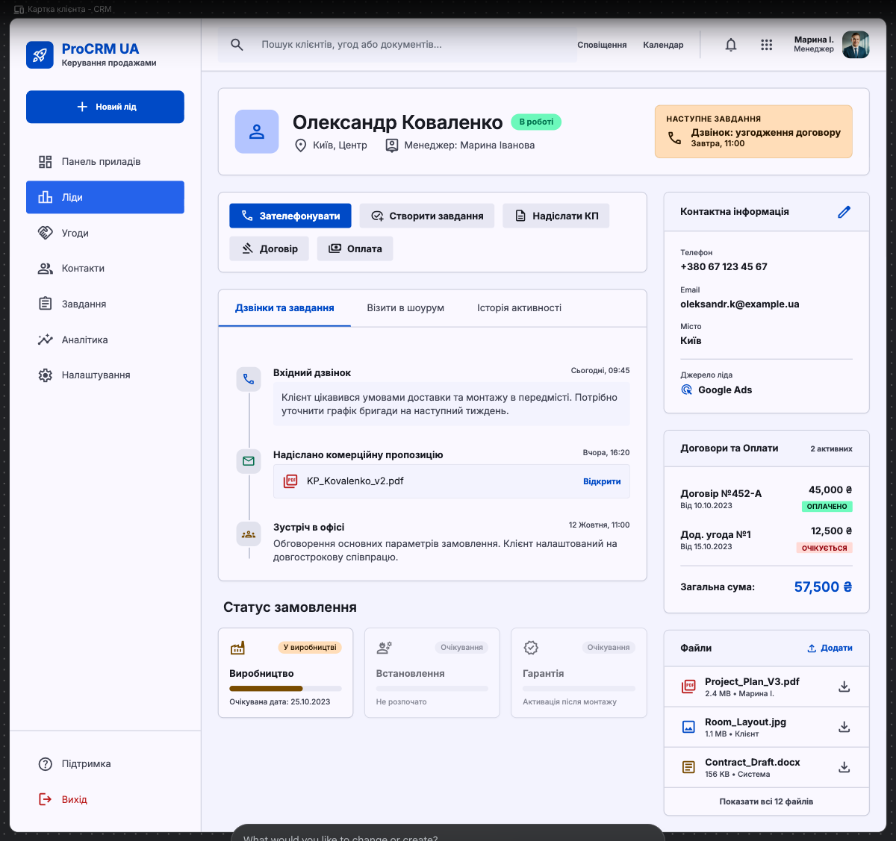

# Design Improvement: картка клієнта KOLSS CRM

## TL;DR

Референс варто використовувати як wireframe та інформаційну архітектуру, але не копіювати його синю стилістику. Для KOLSS оптимальна структура: глобальний topbar, компактний лівий sidebar, header клієнта, центральний timeline із формою швидкої дії та sticky-панель контактів і файлів справа.

## Current reference



*Наданий референс: триколонкова CRM-структура з глобальною навігацією, робочою областю та контекстною правою панеллю.*

## Що беремо

- Topbar із глобальним пошуком і меню користувача.
- Лівий sidebar із основними розділами.
- Повноширинний header клієнта з поточним статусом і наступною задачею.
- Центральний timeline як основну робочу область менеджера.
- Праву sticky-панель для контактів, джерела та файлів.
- Виділений блок наступної задачі.

## Що адаптуємо

- Синій акцент замінюємо на KOLSS green: `#2D4A3E`, м’який акцент `#EEF5F1`.
- Фон і картки використовують наявні токени `--ds-surface-*`, `--ds-border`.
- Не показуємо всі можливі workflow-кнопки одночасно. Основна дія залежить від статусу ліда.
- Не додаємо окремий розділ «Угоди/Проєкти»: у продукті використовується lead-centric workflow.
- ID користувача не показуємо як UUID у topbar. Показуємо ім’я та роль; технічний ID доступний у меню профілю.
- Договори й оплати показуємо коротким summary справа, а повну історію — у timeline.

## Improvement ideas

### 1. Перебудувати глобальну оболонку

Topbar висотою 52–56 px:

- KOLSS CRM та активний офіс;
- пошук за ім’ям, телефоном або ID ліда;
- перемикач контексту для адміністратора;
- сповіщення;
- ім’я, роль та меню користувача.

Sidebar шириною 200–220 px:

- Дашборд;
- Ліди;
- Задачі;
- Користувачі та налаштування — лише для відповідних ролей;
- кнопка «Новий лід».

**Inspired by:** наданий wireframe та знайдений у Lazyweb патерн Folk CRM — глобальний пошук, ліва навігація і профіль контакту в окремій контекстній області.

```text
┌──────────────────────────────────────────────────────────────┐
│ KOLSS / CRM   [ Пошук клієнта, телефону або ID… ]   ДЗ ▾    │
├───────────────┬──────────────────────────────────────────────┤
│ + Новий лід   │                                              │
│ Дашборд       │              Робоча область                  │
│ Ліди          │                                              │
│ Задачі        │                                              │
│ Користувачі   │                                              │
└───────────────┴──────────────────────────────────────────────┘
```

### 2. Зробити header клієнта командним центром

Перший рядок сторінки:

- breadcrumb `Ліди / Картка клієнта` або `← До лідів`;
- ім’я, статус, офіс, менеджер;
- джерело ліда;
- найближча задача з датою;
- одна primary action та меню другорядних дій.

Primary action змінюється за workflow:

- новий → «Взяти в роботу»;
- в роботі → «Записати дзвінок»;
- контакт встановлено → «Запланувати шоурум»;
- візит відбувся → «Запланувати договір»;
- договір підписано → «Записати передоплату»;
- у виробництві → «Записати постоплату» або «Встановлено».

**Inspired by:** наданий wireframe, де header поєднує ідентифікацію клієнта та наступну дію.

```text
← До лідів
┌──────────────────────────────────────────────────────────────┐
│ Олександр Коваленко  [В роботі]      НАСТУПНА ЗАДАЧА         │
│ Київ · Марина Іванова · Google Ads   Передзвонити · 11:00    │
│                              [Записати дзвінок] [•••]         │
└──────────────────────────────────────────────────────────────┘
```

### 3. Об’єднати центральний контент у timeline

Замість окремих довгих секцій «дзвінки», «шоурум», «договори», «оплати» використовуємо одну хронологію:

- дзвінки;
- створені й виконані задачі;
- візити в шоурум;
- договори;
- платежі;
- зміни статусу;
- виробництво, встановлення та гарантія;
- додані файли.

Над timeline розміщуємо компактний composer:

- «Записати дзвінок»;
- «Створити задачу»;
- «Додати нотатку»;
- status-specific action.

Фільтри: `Усі`, `Дзвінки`, `Задачі`, `Шоурум`, `Договір та оплати`.

**Inspired by:** наданий wireframe та Lazyweb-патерни profile activity feed, де події різних типів зводяться в одну послідовність.

```text
┌─────────────────────────────────────────┐
│ [Дзвінок] [Задача] [Нотатка]            │
│ Коментар…                 [Зберегти]    │
├─────────────────────────────────────────┤
│ Усі  Дзвінки  Задачі  Шоурум  Оплати   │
├─────────────────────────────────────────┤
│ ● Не додзвонились             11:20     │
│ │ Коментар менеджера                    │
│ ● Створено задачу              Вчора    │
│ │ Передзвонити клієнту                   │
│ ● Візит у шоурум               12 черв. │
└─────────────────────────────────────────┘
```

### 4. Зробити праву панель контекстною

Права колонка шириною 300–340 px і sticky на desktop:

1. Контактна інформація:
   - телефон із дією «зателефонувати»;
   - email;
   - місто/регіон;
   - джерело і канал;
   - редагування.
2. Файли:
   - назва, тип, розмір;
   - відкрити/завантажити;
   - додати файл.
3. Договір та оплати:
   - поточний стан договору;
   - сума передоплати/постоплати;
   - загальна сума.

На tablet/mobile права панель стає accordion-блоками після header або drawer.

**Inspired by:** Folk CRM та наданий wireframe — незмінний профіль контакту поруч із динамічною історією роботи.

```text
┌──────────────────────┐
│ Контакти         ✎   │
│ +380…                │
│ client@example.com   │
│ Київ                 │
│ Google Ads           │
├──────────────────────┤
│ Договір та оплати    │
│ Договір: підписано   │
│ Передоплата: 45 000  │
├──────────────────────┤
│ Файли         + Додати│
│ contract.pdf         │
│ measurement.jpg      │
└──────────────────────┘
```

## Рекомендована композиція

```text
┌─────────────────────────────────────────────────────────────────────────┐
│ TOPBAR: KOLSS · офіс | глобальний пошук | сповіщення | користувач      │
├──────────────┬──────────────────────────────────────────────────────────┤
│ SIDEBAR      │ ← До лідів                                               │
│              │ ┌──────────────────────────────────────────────────────┐ │
│ Дашборд      │ │ CLIENT HEADER + STATUS + NEXT TASK + PRIMARY ACTION │ │
│ Ліди         │ └──────────────────────────────────────────────────────┘ │
│ Задачі       │ ┌─────────────────────────────────┬────────────────────┐ │
│              │ │ QUICK ACTION / TASK COMPOSER    │ CONTACTS           │ │
│              │ ├─────────────────────────────────┤ SOURCE             │ │
│              │ │ FILTERED ACTIVITY TIMELINE      ├────────────────────┤ │
│              │ │                                 │ CONTRACT/PAYMENTS  │ │
│              │ │                                 ├────────────────────┤ │
│              │ │                                 │ FILES              │ │
│              │ └─────────────────────────────────┴────────────────────┘ │
└──────────────┴──────────────────────────────────────────────────────────┘
```

Desktop grid:

```css
grid-template-columns: minmax(0, 1fr) 320px;
```

Глобальна оболонка:

```css
grid-template-columns: 216px minmax(0, 1fr);
```

## Що вже добре працює в KOLSS

- У дизайн-системі вже визначені потрібні нейтральні поверхні, бордери та KOLSS green.
- Уже є приклади topbar, sidebar, timeline і файлів на сторінці design system.
- Поточна модель даних містить усі сутності для єдиного timeline.
- Workflow дозволяє визначити одну основну дію для кожного статусу.

## Що не варто переносити

- Великий постійний набір action-кнопок.
- Яскраво-синю палітру.
- Надмірну кількість вкладок.
- Окрему сутність «Угода/Проєкт», яка дублює картку ліда.
- Три однаково великі картки виробництва, встановлення та гарантії, коли більшість етапів ще неактивні.

## Implementation priority

1. Глобальний app shell: topbar + sidebar.
2. Нова двоколонкова композиція картки ліда.
3. Єдиний timeline та task composer.
4. Редагування контактів і завантаження файлів.
5. Адаптивний drawer/accordion для правої панелі.

## References

- Наданий CRM wireframe — основний композиційний референс.
- Folk CRM, Lazyweb — sidebar, search і contact profile pattern.
- Profile activity feed patterns, Lazyweb — центральний хронологічний потік.
- Поточна KOLSS Design System — кольори, surfaces, borders, buttons і timeline.
