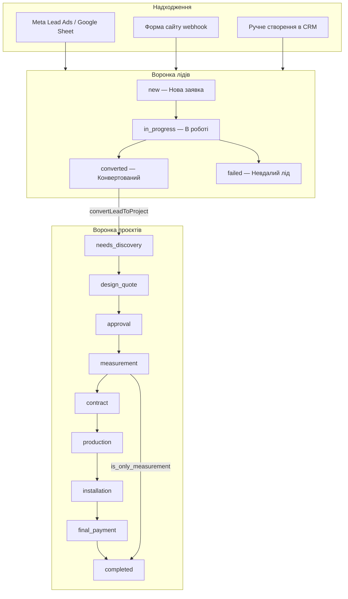

# KOLSS CRM — як працює проєкт

CRM для меблевого бізнесу KOLSS (кухні та меблі під замовлення). Система веде **дві воронки**: кваліфікація лідів і виконання проєктів.

Детальний setup (Supabase, Apps Script, env) — у [README.md](README.md). Цей документ описує **архітектуру, бізнес-логіку та поточний стан реалізації**.

---

## Стек

| Шар | Технологія |
|-----|------------|
| Frontend / API | Next.js 16 (App Router), React 19, TypeScript |
| БД / Auth | Supabase (PostgreSQL, RLS, Storage) |
| Стилі | Tailwind CSS 4 |
| Імпорт лідів | Google Apps Script → webhook CRM |
| Сповіщення | Telegram, Slack (outbox) |

---

## Архітектура воронок



**Ключова ідея:** лід — це кваліфікація (додзвонитись, оцінити цільовість). Проєкт — це виконання замовлення (дизайн, договір, цех, монтаж). Одна пара лід↔проєкт (1:1).

---

## Модель даних

### Лід (`leads`)

| Поле | Опис |
|------|------|
| `lead_status` | `new`, `in_progress`, `converted`, `failed` |
| `callback_due_at` | Нагадування «передзвонити» (лід лишається `in_progress`) |
| `assigned_to` | Менеджер, що взяв лід |
| `loss_reason` | При `failed`: `spam`, `not_target`, `price` |
| `estimated_budget`, `our_quote` | Для аналітики відмов (обов'язкові при `price`) |
| `converted_project_id` | FK на створений проєкт |
| `name`, `phone`, `email`, `city_region` | Контакти |
| `source_system` | `meta_lead_ads`, `site_form`, `manual`, … |
| `product_interest`, `order_comment` | Intake при створенні |
| `project_stage_source` | Intake: чи є в клієнта проєкт |
| Marketing | `ad_*`, `campaign_*`, `form_*`, `platform`, `raw_payload` |

Довідники: `lead_statuses`, `loss_reasons`.

### Проєкт (`projects`)

| Поле | Опис |
|------|------|
| `lead_id` | Зв'язок з лідом (unique) |
| `status` | Етап воронки (див. таблицю нижче) |
| `product_type` | `kitchen`, `home_furniture`, `wardrobe`, `other` |
| `product_details` | Обов'язково для `home_furniture` / `other` |
| `estimated_budget`, `our_quote` | Бюджет клієнта та наш прорахунок |
| `is_only_measurement` | Гілка «тільки замір» |
| `advance_paid`, `final_paid` | Передплата та постоплата |
| `loss_reason` | При архівації |
| `last_activity_at` | Оновлюється при зміні полів / коментарях |
| `assigned_to` | Відповідальний менеджер |

**Етапи проєкту** (`project_stages`):

| Код | Українська назва |
|-----|------------------|
| `needs_discovery` | Виявлення потреб |
| `design_quote` | Створення проєкту та оцінка |
| `approval` | Погодження |
| `measurement` | Заміри |
| `contract` | Договір та передплата |
| `production` | Виготовлення |
| `installation` | Встановлення |
| `final_payment` | Постоплата та акт |
| `completed` | Успішно реалізовано (термінальний) |
| `archived` | Архів / відмова (термінальний) |

### Документи

- `lead_attachments` — файли при створенні ліда (bucket `lead-attachments`)
- `project_attachments` — договір / акт / інше (bucket `project-attachments`, поле `document_type`)

### Інше

- `lead_comments`, `project_comments` — коментарі
- `lead_events` — аудит (створення, зміна статусу, no_answer, конверсія)
- `lead_notifications` — outbox Telegram/Slack
- `lead_import_sources`, `lead_import_runs` — імпорт з Google Sheets
- `tasks` — таблиця є в БД, **навмисно не використовується в UI**: нагадування покриваються `callback_due_at` + бейджі «Передзвонити» та `last_activity_at` на проєктах. Окремий task-workflow не планується, поки не з’явиться вимога до assignee/deadline поза воронкою ліда.

---

## UI та маршрути

| URL | Призначення |
|-----|-------------|
| `/login` | Вхід |
| `/app/leads` | Список лідів, фільтри по статусу та «Передзвонити» |
| `/app/leads/new` | Ручне створення ліда |
| `/app/leads/[id]` | Картка ліда: дії, коментарі, історія |
| `/app/projects` | Список проєктів |
| `/app/projects/[id]` | Картка проєкту: поля, етапи, документи |
| `/app/dashboard` | Агрегована аналітика (ліди/проєкти за статусом, прострочені передзвони) |
| `/app/admin/users` | Керування користувачами (`super_admin`) |

### Дії на ліді

- **Взяти в роботу** — `new` → `in_progress`, призначає `assigned_to`
- **Не додзвонився** — встановлює `callback_due_at` (+2 год; після 18:00 офісу → наступний робочий день 10:00)
- **Додзвонився** — скидає `callback_due_at`
- **Створити проєкт** — конверсія в проєкт, лід → `converted`
- **Невдалий лід** — `failed` + `loss_reason` (з валідацією бюджету при `price`)

### Дії на проєкті

- Лінійний перехід етапів кнопкою «Далі»
- **Тільки замір** — з етапу `measurement` можна закрити в `completed`
- **Архівувати** — `archived` + `loss_reason`
- Редагування полів на всіх не-термінальних етапах
- Upload договору та акту через форму проєкту

### Нагадування (без cron)

| Ситуація | Як показується |
|----------|----------------|
| Не додзвонились | Бейдж «Передзвонити до …» у списку та на картці ліда |
| Погодження >3 днів без активності | Бейдж «Думає >3 дні» у списку проєктів (обчислюється при завантаженні) |

---

## Інтеграції

### Meta Lead Ads → CRM

```
Meta Lead Ads → Google Sheet → Apps Script (кожні 5 хв)
  → POST /api/webhooks/import-lead
  → upsert leads (ключ: source_system + external_lead_id)
  → Telegram/Slack при новому ліді
```

Скрипт: [`scripts/google-apps-script/meta-leads-import.gs`](scripts/google-apps-script/meta-leads-import.gs)

### Форма сайту

`POST /api/webhooks/site-lead` — той самий `IMPORT_WEBHOOK_SECRET`, `source_system = site_form`.

### Telegram / Slack

Шаблон при новому ліді:

```
🔔 Нова заявка!
👤 Ім'я: …
📞 Тел: …
🌐 Джерело: …
🔗 Посилання на CRM: …
```

Код: [`src/services/notifications/`](src/services/notifications/)

### Retry нотифікацій

`POST /api/webhooks/process-notifications` — вручну або зовнішнім scheduler (cron у Vercel **не використовується**).

---

## Ролі та доступ

| Роль | Доступ |
|------|--------|
| `super_admin` | Усі офіси, адмін користувачів |
| `curator` | Ліди/проєкти кількох офісів, фільтр по офісу |
| `office_admin` | Офіси з membership |
| `office_member` | Офіси з membership |

RLS у PostgreSQL обмежує дані по `office_id` через `can_access_office()`.

Офіси: **Київ** (`kyiv`), **Варшава** (`warsaw`). Лейбли UK/PL для форм і довідників.

---

## Структура коду

```
src/
├── actions/           # Server actions (leads, projects, users)
├── app/
│   ├── api/webhooks/  # import-lead, site-lead, process-notifications
│   └── app/           # UI: leads, projects, admin
├── components/        # Форми, панелі дій, header
├── lib/               # Типи, валідація, timezone, опції CRM
└── services/
    ├── import/        # Мапінг Meta → lead, upsert
    ├── notifications/ # Outbox Telegram/Slack
    └── storage/       # Upload lead/project attachments

supabase/migrations/   # Версіонована схема БД
scripts/               # Apps Script, SQL reset
```

---

## Міграції БД (хронологія)

| Файл | Зміст |
|------|-------|
| `20260526120000_init.sql` | Базова схема, офіси, ліди, import, notifications |
| `20260526130000_add_city_region.sql` | Місто/регіон |
| `20260526140000_lead_form_fields_attachments.sql` | Поля форми, lead_attachments |
| `20260526150000_crm_status_changed_at.sql` | Timestamp зміни статусу |
| `20260526160000_lead_attachments_storage_policies.sql` | Storage policies |
| `20260609120000_user_admin.sql` | Curator, деактивація користувачів |
| `20260610120000_lead_project_split.sql` | Split Lead/Project, tasks, project_stages |
| `20260610130000_project_attachments_storage.sql` | Bucket project-attachments |
| `20260610140000_lead_callback_due.sql` | callback_due_at для нагадувань |

Застосування: `npx supabase db push`

---

## Змінні оточення

| Змінна | Призначення |
|--------|-------------|
| `NEXT_PUBLIC_SUPABASE_URL` | URL Supabase |
| `NEXT_PUBLIC_SUPABASE_ANON_KEY` | Публічний ключ |
| `SUPABASE_SERVICE_ROLE_KEY` | Service role (імпорт, storage, admin users) |
| `NEXT_PUBLIC_SITE_URL` | Локальний URL |
| `NEXT_PUBLIC_SITE_URL_PUBLIC` | Публічний URL для лінків у Telegram |
| `IMPORT_WEBHOOK_SECRET` | Авторизація webhook-ів |
| `TELEGRAM_BOT_TOKEN_KYIV/WARSAW` | Боти Telegram |
| `TELEGRAM_CHAT_ID_KYIV/WARSAW` | Чати для сповіщень |
| `SLACK_WEBHOOK_URL_KYIV/WARSAW` | Slack (опційно) |

---

## Що реалізовано (поточний стан)

- [x] Двоетапна воронка: ліди (4 статуси) + проєкти (10 етапів)
- [x] Конверсія ліда в проєкт з переносом `product_interest`
- [x] Валідація відмов (`loss_reason`, бюджет при «не підійшла ціна»)
- [x] Умовне поле `product_details` на проєкті
- [x] Upload договору та акту (`project_attachments`)
- [x] Гілка «тільки замір» (`is_only_measurement`)
- [x] Нагадування без cron: `callback_due_at` + бейджі
- [x] Бейдж «Думає >3 дні» на етапі погодження
- [x] Meta import через Apps Script + Telegram
- [x] Webhook форми сайту
- [x] Ручне створення лідів з файлами
- [x] Multi-office (Київ / Варшава), ролі, RLS
- [x] Адмін-панель користувачів

## Що поки не зроблено

- [ ] Kanban-дошка проєктів
- [ ] Редагування ліда після створення
- [x] Базовий dashboard (`/app/dashboard`: ліди/проєкти за статусом, прострочені передзвони)
- [ ] Розширений dashboard (conversion rate, loss reasons, delta бюджету)
- [ ] Прямий Meta webhook (зараз через Google Sheets)
- [ ] Google Ads як окреме джерело (код `google_ads` передбачений, мапінг — ні)

---

## Відомі нюанси

**Два FK між `projects` і `leads`:** `projects.lead_id` та `leads.converted_project_id`. У Supabase-запитах embed пишеться явно: `leads!lead_id(...)`, інакше помилка «more than one relationship was found».

**README застарів частково:** згадує старий `crm_status` / `pipeline_stages` на ліді. Актуальна модель — у цьому документі та міграції `20260610120000_lead_project_split.sql`.

---

## Шар даних і кеш (після аудиту 2026-06)

- `src/lib/auth.ts` — `getSessionContext` з `React.cache()` (один auth-запит на RSC request)
- `src/lib/queries/reference-data.ts` — `unstable_cache` для offices / lead_statuses / project_stages
- `src/lib/db/*` — доступ до даних (list/get leads, projects, dashboard RPC)
- `src/lib/cache-tags.ts` — `revalidateTag` + `revalidatePath` після мутацій
- Міграція `20260611120000_performance_indexes_and_rpc.sql` — composite indexes, RPC `take_lead_in_progress`, `mark_lead_failed`, `get_dashboard_stats`

Після зміни схеми: `npx supabase gen types typescript --linked > src/lib/types/supabase.ts`

## Корисні команди

```bash
npm run dev          # локальна розробка
npm run build        # production build
npx supabase db push # застосувати міграції
```

Скрипт скидання активних лідів у `new`: [`scripts/reset-active-leads.sql`](scripts/reset-active-leads.sql)
